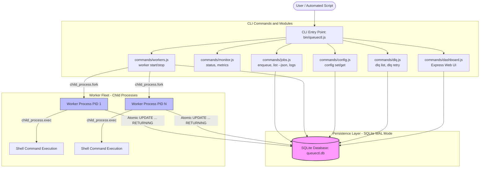
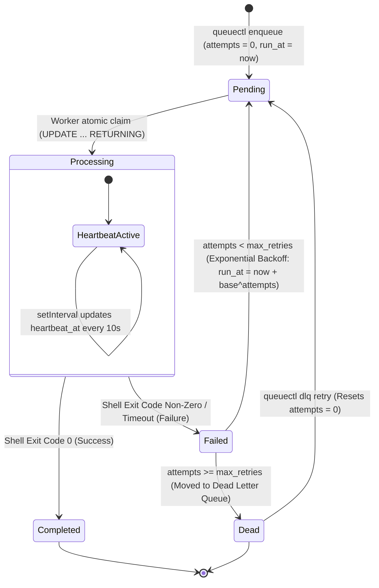
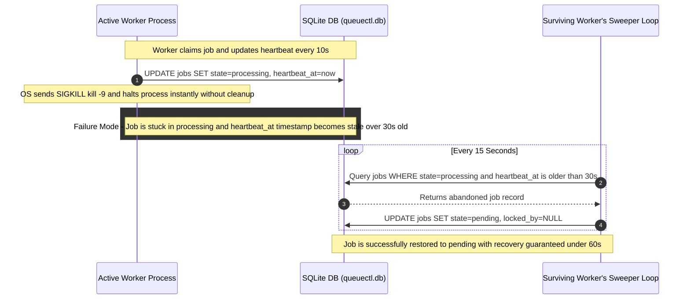

# QueueCTL - Visual Architecture & System Workflow (ARCHITECTURE.md)

This document provides high-level visual diagrams illustrating the modular CLI component flow, job lifecycle state machine, and automated crash recovery sweeper sequence for **QueueCTL**.

---

## 1. High-Level System Architecture & Component Flow

This diagram illustrates how user commands interact with the modular CLI structure, how SQLite WAL mode handles cross-process persistence, and how background workers interact with OS-level execution and signaling.

---

## 2. Job State Machine Workflow

This diagram outlines the exact transitions a job undergoes throughout its lifecycle, from initial validation and persistence to processing, backoff retries, completion, or DLQ quarantine.

---

## 3. Crash Recovery & Sweeper Lifecycle (The "Murder Test" Defense)

This diagram details the sequence of events when a worker process experiences an abrupt termination (`SIGKILL` / `kill -9`) and how the background Sweeper safely restores system integrity within the 60-second window.

