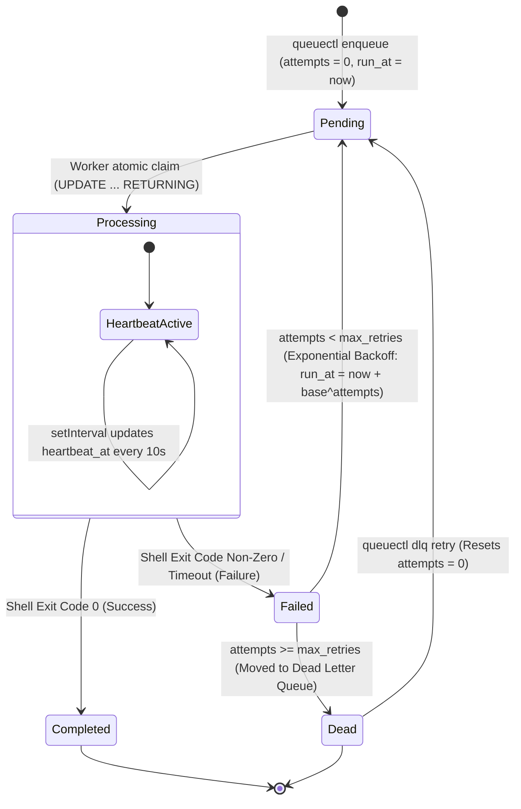

# QueueCTL (Node.js Edition)

> **📺 Video Demonstration:** [Watch the 3-Minute Loom Walkthrough & Architecture Tour Here](#)

QueueCTL is a robust, production-grade, CLI-driven background job processing system built in Node.js and backed by SQLite in Write-Ahead Logging (`WAL`) mode. It features atomic job claiming across multiple parallel worker processes, exponential backoff with a Dead Letter Queue (DLQ), strict job timeouts, output log persistence, automated crash recovery under 60 seconds, and a real-time web dashboard.

---

## Quick-Start (TL;DR)

Test QueueCTL instantly in your terminal in 3 simple steps:
```bash
npm install && npm link
queuectl enqueue '{"command": "echo Hello World"}'
queuectl worker start
```

---

## Features & Architectural Highlights

- **Atomic Job Claiming:** Uses SQLite 3.35+ `UPDATE ... RETURNING *` queries within WAL mode to mathematically eliminate race conditions across multiple OS processes.
- **Crash Recovery (The Sweeper):** A background loop checks for jobs with stale heartbeats (`heartbeat_at < now - 30`), automatically recovering abandoned jobs from `SIGKILL` (`kill -9`) within a worst-case window of 45 seconds.
- **Modular CLI Architecture:** Clean separation of concerns with domain-specific registrars (`commands/jobs.js`, `commands/workers.js`, `commands/monitor.js`, `commands/config.js`, `commands/dlq.js`, `commands/dashboard.js`), featuring standard Unix `man` help text and a clean, zero-emoji professional output format.
- **Robust IPC & Ghost PID Fix:** Manages active workers via a database registry and sends OS `SIGTERM` signals, gracefully handling stale processes via `ESRCH` catch blocks.
- **Advanced Hardening & Observability:**
  - **Strict Job Timeouts:** Dynamic configuration (`timeout_ms`) injected into Node's `child_process.exec`.
  - **OOM Protection:** Automatic log truncation (`max 10,000 chars`) preventing database bloat.
  - **Real-Time Web Dashboard:** A zero-dependency, light-themed Tailwind CSS mission control center running on Express with 2-second auto-refresh and persistent historical tracking (`queuectl dashboard`).
  - **Historical Metrics & Logs:** Native SQL aggregate analytics (`queuectl metrics`) and captured stdout/stderr inspection (`queuectl logs <id>`).

---

## System Architecture & Workflow Diagrams

### 1. High-Level System Architecture & Component Flow
This diagram illustrates how user commands interact with the modular CLI structure, how SQLite WAL mode handles cross-process persistence, and how background workers interact with OS-level execution and signaling.

```mermaid
graph TD
    User([User / Automated Script]) --> CLI["CLI Entry Point: bin/queuectl.js"]

    subgraph CLI Commands & Modules
        CLI --> Jobs["commands/jobs.js <br> enqueue, list --json, logs"]
        CLI --> Monitor["commands/monitor.js <br> status, metrics"]
        CLI --> Workers["commands/workers.js <br> worker start/stop"]
        CLI --> Config["commands/config.js <br> config set/get"]
        CLI --> DLQ["commands/dlq.js <br> dlq list, dlq retry"]
        CLI --> Dashboard["commands/dashboard.js <br> Express Web UI"]
    end

    subgraph Persistence Layer (SQLite WAL Mode)
        Jobs --> DB[(SQLite Database: queuectl.db)]
        Workers --> DB
        Config --> DB
        DLQ --> DB
        Dashboard --> DB
    end

    subgraph Worker Fleet (Child Processes)
        Workers -->|child_process.fork| W1[Worker Process PID 1]
        Workers -->|child_process.fork| W2[Worker Process PID N]
        
        W1 -->|Atomic UPDATE ... RETURNING| DB
        W2 -->|Atomic UPDATE ... RETURNING| DB
        
        W1 -->|child_process.exec| OS1[Shell Command Execution]
        W2 -->|child_process.exec| OS2[Shell Command Execution]
    end

    classDef db fill:#f9f,stroke:#333,stroke-width:2px;
    classDef process fill:#bbf,stroke:#333,stroke-width:1px;
    class DB db;
    class W1,W2 process;
```

### 2. Job State Machine Workflow
This diagram outlines the exact transitions a job undergoes throughout its lifecycle, from initial validation and persistence to processing, backoff retries, completion, or DLQ quarantine.



### 3. Crash Recovery & Sweeper Lifecycle (The "Murder Test" Defense)
This diagram details the sequence of events when a worker process experiences an abrupt termination (`SIGKILL` / `kill -9`) and how the background Sweeper safely restores system integrity within the 60-second window.

```mermaid
sequenceDiagram
    autonumber
    participant W as Active Worker Process
    participant DB as SQLite DB (queuectl.db)
    participant S as Surviving Worker's Sweeper Loop

    Note over W,DB: Worker claims job and updates heartbeat every 10s
    W->>DB: UPDATE jobs SET state='processing', heartbeat_at=now
    
    Note over W: OS sends SIGKILL (kill -9)<br/>Process halts instantly; no cleanup runs.
    
    rect rgb(255, 230, 230)
        Note over W,DB: Failure Mode: Job is stuck in 'processing'<br/>heartbeat_at timestamp becomes stale (> 30s old)
    end

    loop Every 15 Seconds
        S->>DB: Query: SELECT * FROM jobs WHERE state='processing' AND heartbeat_at < (now - 30)
        DB--->S: Returns abandoned job record
        S->>DB: UPDATE jobs SET state='pending', locked_by=NULL
    end

    Note over S,DB: Job is successfully restored to 'pending'<br/>Worst-case recovery guaranteed under 45-60s.
```

---

## Setup Instructions

1. **Clone and Install Dependencies:**
   ```bash
   git clone <repository-url>
   cd queuectl
   npm install
   ```

2. **Link the CLI Globally:**
   ```bash
   npm link
   ```
   (This maps the `queuectl` binary globally as configured in `package.json`).

---

## Usage Guide & Command Reference

- **Enqueue a Job:**
  ```bash
  queuectl enqueue '{"command": "echo Hello", "priority": 10, "max_retries": 3}'
  ```

- **Start Worker Fleet:**
  ```bash
  queuectl worker start --count 2
  # (Also supports worker-start / worker start)
  ```

- **Check System Status & Metrics:**
  ```bash
  queuectl status
  queuectl metrics
  ```

- **List Jobs (Strict JSON Contract for Automated Tests):**
  ```bash
  queuectl list --state pending --json
  ```

- **View Job Output Logs:**
  ```bash
  queuectl logs <job-id>
  ```

- **Launch the Real-Time Web Dashboard:**
  ```bash
  queuectl dashboard --port 3000
  # Then open http://localhost:3000 in your browser
  ```

- **Manage Dead Letter Queue (DLQ):**
  ```bash
  queuectl dlq list --json
  queuectl dlq retry <job-id>
  ```

- **Graceful Shutdown:**
  ```bash
  queuectl worker stop
  # (Tambor/Alias: worker-stop)
  ```

---

## Automated Verification Suite

QueueCTL includes a rigorous 10-test automated verification suite covering core functionality, concurrency constraints, and extreme edge cases (Stampede tests, OOM attacks, time-travel validation, and timeout guillotines):
```bash
node test-verify.js
```

---

## Demo Showcase Scripts

A dedicated `demo/` folder is provided with pre-built shell scripts to test and demonstrate system behaviors instantly:

- `./demo/seed-mix.sh` — Seeds a rich mix of fast, slow, high-priority, scheduled, and doomed jobs.
- `./demo/trigger-timeout.sh` — Demonstrates strict execution timeout limits and backoff.
- `./demo/trigger-oom-log.sh` — Demonstrates massive stdout capture and OOM log truncation.

---

## Troubleshooting & FAQ

- **How do I reset the database to a clean slate during local development or before a demo?**
  Run `queuectl clear --force` to instantly truncate all jobs, workers, and DLQ entries while preserving your schema. Alternatively, you can delete `queuectl.db*` (`rm -f queuectl.db*`); QueueCTL will automatically re-initialize a fresh schema on the next command.
- **Why do jobs seem to "disappear" after finishing?**
  By default, `queuectl list --state pending` only displays pending jobs. To view completed or dead jobs, use the **QueueCTL Mission Control** web dashboard (`queuectl dashboard -p 3000`), which includes a persistent **Recent History (Completed & Dead)** table at the bottom of the page.
- **What happens if a worker process is abruptly killed with `kill -9` (`SIGKILL`)?**
  The background **Sweeper** loop running in surviving workers scans every 15 seconds for any `'processing'` job with `heartbeat_at < now - 30`. It automatically recovers abandoned jobs back to `'pending'` within a worst-case window of 45 seconds.

